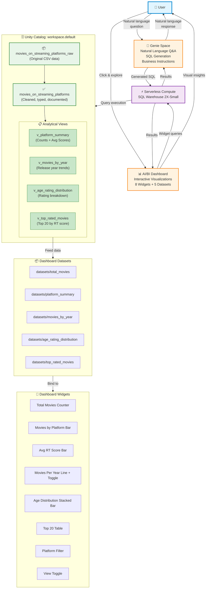

# 🧱 Databricks Projects

Welcome! Here you will find insightful and creative ways to interpret data using a powerful AI-powered software used in many data analytical environments around the workforce known as 🧱 [Databricks](https://www.databricks.com). 

# Projects

## 🎬 Movies on Streaming Platforms

📁🔗 [Movies on Streaming Platforms, project files](https://github.com/enzorcortes/Databricks_Projects/tree/main/moviesonstreamingplatforms)

🎛️🔗 [Movies on Streaming Platforms, AI/BI Dashboard](https://dbc-4b6fd519-190f.cloud.databricks.com/dashboardsv3/01f1bb921924137d9361d64edd089231/published?o=7474655006789075)

🧞‍♂️🔗 [Movies on Streaming Platform, Genie Space (AI Agent)](https://dbc-4b6fd519-190f.cloud.databricks.com/genie/rooms/01f1bb9219541440ae851b68b9eeacd6?o=7474655006789075)

### Use Case

This project enables **self-service analytics** for movie streaming data, allowing business users and analysts to:
- 📊 Explore 9,500+ movies across Netflix, Hulu, Prime Video, and Disney+
- 🤖 Ask natural language questions without writing SQL
- 📈 Monitor key metrics: platform coverage, ratings, release trends, and age distributions
- 🔍 Filter and drill down into specific platforms or time periods

**Target Audience**: Data analysts, business users, and anyone learning Databricks AI/BI capabilities.

### Dataset

- **Source**: CSV file containing movie metadata from major streaming platforms
- **Size**: 9,515 movies
- **Platforms**: Netflix, Hulu, Prime Video, Disney+
- **Attributes**: Title, release year, age rating, Rotten Tomatoes score, platform availability

### Key Features

✅ **Unity Catalog Governance**: Centralized metadata, RBAC-ready schema  
✅ **AI/BI Dashboard**: 8 interactive widgets with platform filtering  
✅ **Genie Space**: Natural language Q&A over 5 tables/views  
✅ **Serverless Compute**: Zero cluster management on Free Edition  
✅ **Lightweight Semantic Layer**: SQL views for reusable business logic  
✅ **Visual Accessibility**: Check marks (✓/✗) for platform availability

### Agent Architecture:

### Diagram Key

### Components
- 👤 **User**: End users interacting with Genie or Dashboard
- 🤖 **Genie Space**: Natural language Q&A agent
- 📊 **Dashboard**: Interactive visualizations and KPIs
- ⚡ **Compute**: Serverless SQL Warehouse (Free Edition)
- 🗄️ **Unity Catalog**: Data governance and storage layer
- 📋 **Views**: Analytical views serving as lightweight semantic layer

### Data Flow
1. User asks question → Genie generates SQL → Warehouse executes
2. User explores dashboard → Widget queries → Warehouse executes
3. All queries hit Unity Catalog tables/views
4. Results flow back to user via Genie (text) or Dashboard (visuals)

### Color Coding
- **Blue** (User): External interaction layer
- **Orange** (Applications): Genie Space + AI/BI Dashboard
- **Purple** (Compute): Serverless SQL Warehouse
- **Green** (Data): Unity Catalog tables and views
---
