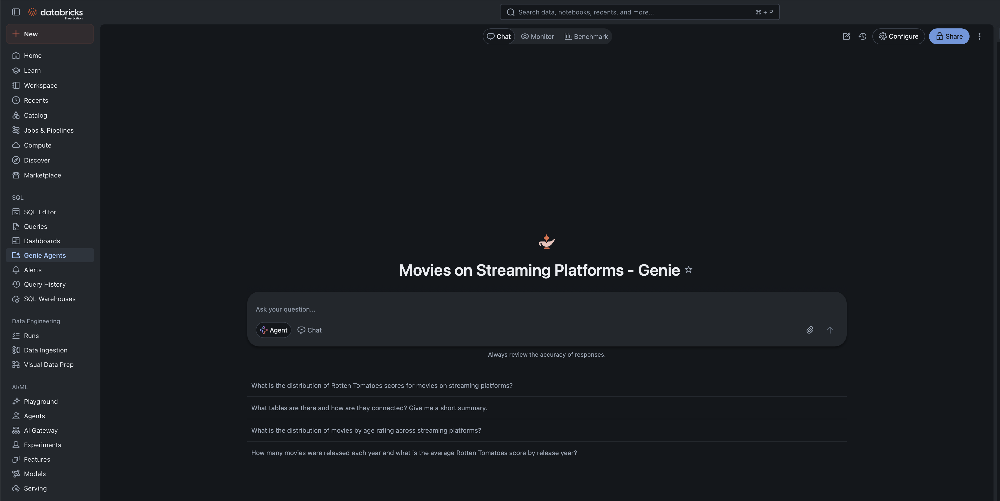
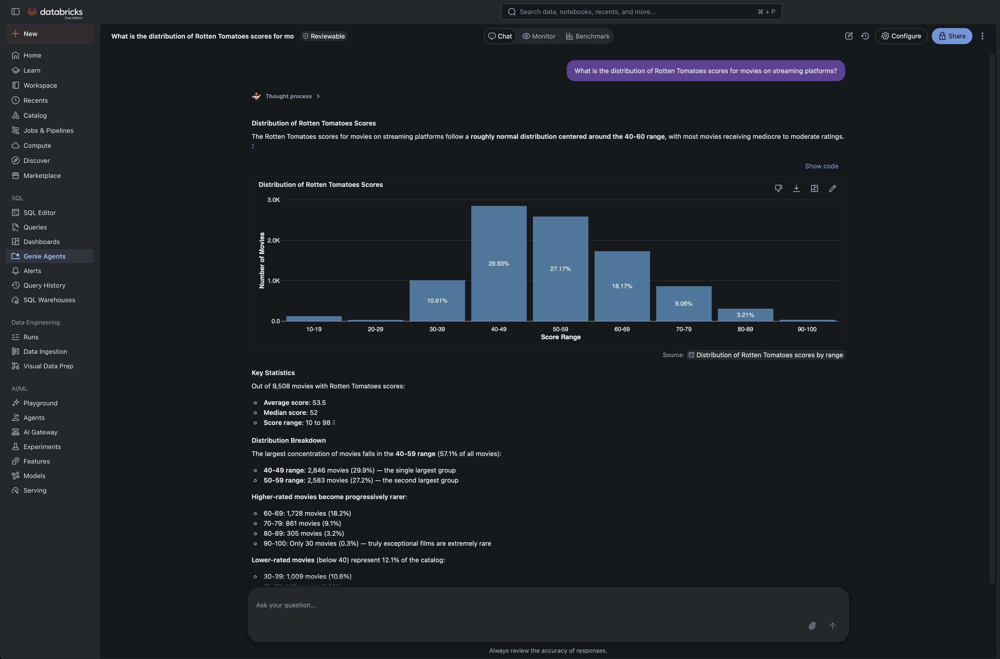
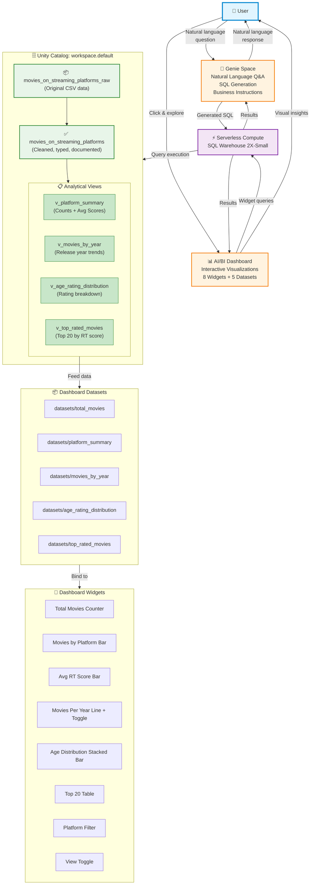
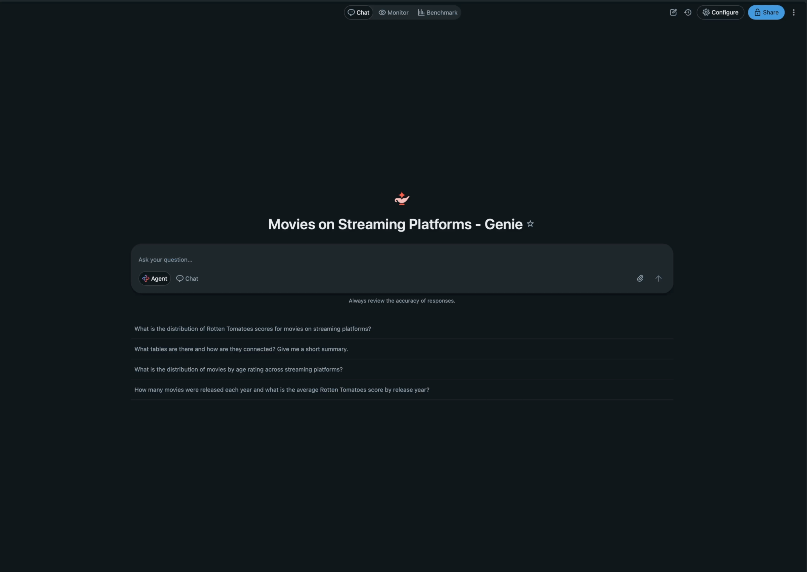

# 🎬 Movies on Streaming Platforms - Databricks AI/BI Project

A learning project demonstrating end-to-end Databricks AI/BI capabilities on **Free Edition**, featuring Unity Catalog governance, AI/BI dashboards, and natural language Q&A with Genie Space.

[](https://www.databricks.com/)
[](#)
[](#)

---

## 📑 Table of Contents

- [Project Overview](#-project-overview)
  - [Use Case](#use-case)
  - [Dataset](#dataset)
  - [Key Features](#key-features)
- [Architecture](#-architecture)
  - [Architecture Diagram](#architecture-diagram)
  - [Component Stack](#component-stack)
  - [Data Flow](#data-flow)
- [Data Pipeline](#-data-pipeline)
  - [Tables](#tables)
  - [Analytical Views](#analytical-views-lightweight-semantic-layer)
- [Dashboard](#-dashboard)
  - [Widgets](#widgets)
  - [Interactive Features](#interactive-features)
- [Genie Space](#-genie-space)
  - [Capabilities](#capabilities)
  - [Sample Questions](#sample-questions)
- [Design Decisions](#-design-decisions)
  - [Why No Formal Semantic Layer?](#why-no-formal-semantic-layer)
  - [Why No Relationship Graphs?](#why-no-relationship-graphs)
  - [Platform Column Design](#platform-column-design)
- [Free Edition Considerations](#-free-edition-considerations)
- [File Structure](#-file-structure)
- [Setup Instructions](#-setup-instructions)
- [Future Enhancements](#-future-enhancements)
- [Snowflake to Databricks Mapping](#-snowflake-to-databricks-mapping)
- [Resources](#-resources)

---

## 🎯 Project Overview

### Use Case

This project enables **self-service analytics** for movie streaming data, allowing business users and analysts to:
- 📊 Explore 9,500+ movies across Netflix, Hulu, Prime Video, and Disney+
- 🤖 Ask natural language questions without writing SQL
- 📈 Monitor key metrics: platform coverage, ratings, release trends, and age distributions
- 🔍 Filter and drill down into specific platforms or time periods

**Target Audience**: Data analysts, business users, and anyone learning Databricks AI/BI capabilities.

### Dataset

- **Source**: CSV file containing movie metadata from major streaming platforms
- **Size**: 9,515 movies
- **Platforms**: Netflix, Hulu, Prime Video, Disney+
- **Attributes**: Title, release year, age rating, Rotten Tomatoes score, platform availability

### Key Features

✅ **Unity Catalog Governance**: Centralized metadata, RBAC-ready schema  
✅ **AI/BI Dashboard**: 8 interactive widgets with platform filtering  
✅ **Genie Space**: Natural language Q&A over 5 tables/views  
✅ **Serverless Compute**: Zero cluster management on Free Edition  
✅ **Lightweight Semantic Layer**: SQL views for reusable business logic  
✅ **Visual Accessibility**: Check marks (✓/✗) for platform availability

---

## 🏗️ Architecture

### Architecture Diagram

See [genie-architecture.mmd](./genie-architecture.mmd) for the full Mermaid diagram.

**High-Level Flow**:
```
👤 User
  ↓
  ├─→ 🤖 Genie Space (Natural Language Q&A)
  └─→ 📊 AI/BI Dashboard (Interactive Visualizations)
        ↓
      ⚡ Serverless SQL Warehouse
        ↓
      🗄️ Unity Catalog (workspace.default)
        ├─ movies_on_streaming_platforms_raw (CSV import)
        ├─ movies_on_streaming_platforms (cleaned table)
        └─ Analytical Views (v_platform_summary, v_movies_by_year, etc.)
```

### Component Stack

| Layer | Component | Purpose |
|-------|-----------|---------|
| **Application** | Genie Space | Ad-hoc natural language queries |
| **Application** | AI/BI Dashboard | Curated visualizations and KPIs |
| **Compute** | Serverless SQL Warehouse (2X-Small) | Query execution engine |
| **Data** | Unity Catalog (workspace.default) | Governed data storage |
| **Storage** | Delta Lake Tables | ACID-compliant table format |

### Data Flow

1. **Ingestion**: CSV → Unity Catalog raw table → Cleaned table
2. **Transformation**: Cleaned table → 4 analytical views (semantic layer)
3. **Consumption**: 
   - Genie generates SQL → Views/Tables → Natural language response
   - Dashboard datasets → Views/Tables → Interactive widgets

---

## 📦 Data Pipeline

### Tables

#### `movies_on_streaming_platforms_raw`
- **Purpose**: Original CSV data (preserved for reference)
- **Schema**: 11 columns (string types from CSV)
- **Rows**: 9,515

#### `movies_on_streaming_platforms` (Cleaned)
- **Purpose**: Production-ready table with typed columns
- **Schema**:
  - `id` (int): Unique identifier
  - `title` (string): Movie title
  - `release_year` (int): Release year
  - `age_rating` (string): Age/content rating (e.g., PG-13, R)
  - `rotten_tomatoes_score` (int): Critic score (0-100)
  - `on_netflix` (boolean): Available on Netflix
  - `on_hulu` (boolean): Available on Hulu
  - `on_prime_video` (boolean): Available on Prime Video
  - `on_disney_plus` (boolean): Available on Disney+
- **Enhancements**:
  - Boolean flags for platform availability
  - snake_case column names
  - Column comments for documentation
  - Proper data types (int, boolean, string)

### Analytical Views (Lightweight Semantic Layer)

#### `v_platform_summary`
Aggregates movie counts and average Rotten Tomatoes scores per platform.
```sql
SELECT 
  'Netflix' AS platform,
  COUNT(*) AS movie_count,
  AVG(rotten_tomatoes_score) AS avg_score
FROM movies_on_streaming_platforms
WHERE on_netflix = true
-- Union for other platforms...
```

#### `v_movies_by_year`
Release year trends (2000+) per platform for time series analysis.

#### `v_age_rating_distribution`
Age rating breakdown per platform for content profiling.

#### `v_top_rated_movies`
Top 20 movies by Rotten Tomatoes score for dashboard table widget.

**Design Rationale**: SQL views provide a **lightweight semantic layer** sufficient for single-dashboard projects. They centralize business logic (metric definitions, aggregations) without the overhead of formal Unity Catalog Metric Views.

---

## 📊 Dashboard

**Dashboard Name**: [Movies on Streaming Platforms](#)

### Widgets

| Widget | Type | Purpose | Filterable |
|--------|------|---------|------------|
| **Total Movies** | Counter | Overall movie count (9,515) | ❌ No |
| **Movies by Platform** | Bar Chart | Compare platform library sizes | ✅ Yes |
| **Avg RT Score by Platform** | Bar Chart | Compare platform quality | ✅ Yes |
| **Movies Released Per Year** | Line Chart | Time series trends (2000+) with toggle | ✅ Yes |
| **Age Rating Distribution** | Stacked Bar | Age rating breakdown by platform | ✅ Yes |
| **Top 20 Highest Rated Movies** | Table | Sorted by RT score, shows platform | ✅ Yes |
| **Filter by Platform** | Multi-Select | Apply platform filter globally | N/A |
| **View (Movies Per Year)** | Single-Select | Toggle: "Platforms" vs "All Time" | N/A |

### Interactive Features

#### Platform Filter
- **Type**: Multi-select dropdown
- **Values**: Netflix, Hulu, Prime Video, Disney+
- **Applies to**: All widgets except "Total Movies" counter
- **Behavior**: Filters datasets to show only selected platforms

#### View Mode Toggle (Line Chart)
- **Options**:
  - **"Platforms"**: 4 separate lines (one per platform)
  - **"All Time"**: Single combined line (total across all platforms)
- **Use Case**: Compare platform trends vs. aggregate industry trends

#### Visual Accessibility
- **Platform columns**: Display ✓ (available) or ✗ (not available) instead of true/false
- **Age rating nulls**: Display "No info." instead of blank/null
- **RT Score alignment**: Left-aligned for readability

---

## 🤖 Genie Space

**Genie Space Name**: Movies on Streaming Platforms

### Capabilities

- ✅ Natural language to SQL conversion
- ✅ Query 5 tables/views (1 cleaned table + 4 analytical views)
- ✅ Business context understanding (platform names, age ratings, metrics)
- ✅ Formatted responses with explanations
- ⚠️ **Free Edition**: Fully supported (no limitations)

### Sample Questions

Try asking Genie:
- "How many movies are on Netflix?"
- "What's the average Rotten Tomatoes score for Disney+ movies?"
- "Show me PG-13 movies released in 2020 with a score above 80"
- "Which platform has the most movies released after 2015?"
- "List the top 5 highest rated movies on Hulu"





### Query Flow Example

```
1. User: "What's the average RT score for Netflix movies?"
   ↓
2. Genie generates SQL:
   SELECT AVG(rotten_tomatoes_score) 
   FROM workspace.default.movies_on_streaming_platforms 
   WHERE on_netflix = true
   ↓
3. Serverless Warehouse executes query
   ↓
4. Genie formats response: "The average Rotten Tomatoes score 
   for Netflix movies is 68.4."
```
### Agent Architecture:


### Diagram Key

### Components
- 👤 **User**: End users interacting with Genie or Dashboard
- 🤖 **Genie Space**: Natural language Q&A agent
- 📊 **Dashboard**: Interactive visualizations and KPIs
- ⚡ **Compute**: Serverless SQL Warehouse (Free Edition)
- 🗄️ **Unity Catalog**: Data governance and storage layer
- 📋 **Views**: Analytical views serving as lightweight semantic layer

### Data Flow
1. User asks question → Genie generates SQL → Warehouse executes
2. User explores dashboard → Widget queries → Warehouse executes
3. All queries hit Unity Catalog tables/views
4. Results flow back to user via Genie (text) or Dashboard (visuals)

### Color Coding
- **Blue** (User): External interaction layer
- **Orange** (Applications): Genie Space + AI/BI Dashboard
- **Purple** (Compute): Serverless SQL Warehouse
- **Green** (Data): Unity Catalog tables and views



---

## 🎯 Design Decisions

### Why No Formal Semantic Layer?

**Current Approach**: SQL views (`v_*`) serve as a lightweight semantic layer.

**Rationale**:
- ✅ **Single dashboard scope**: No metric reuse across multiple dashboards yet
- ✅ **Straightforward metrics**: Counts, averages, no complex calculations
- ✅ **Learning focus**: Appropriate complexity for educational project
- ✅ **Clean & documented**: Views provide single source of truth

**When to upgrade to Unity Catalog Metric Views**:
- 📊 Building a second dashboard reusing these metrics
- 🏢 Multi-team environment requiring centrally governed metrics
- 📐 Complex calculated measures (e.g., "Content Quality Score" = weighted formula)
- 🔐 Metric-level governance requirements

### Why No Relationship Graphs?

**Current Data Model**: Single entity (movies) with boolean platform flags.

**Not needed because**:
- No joins required (all data in one table)
- No multiple related entities (e.g., Movies ← Actors, Movies ← Reviews)
- Simple one-to-many explosions handled in dataset queries

**When relationship graphs add value**:
- Multiple fact/dimension tables requiring joins
- Cross-entity measures (e.g., "Average user rating per movie per platform")
- Complex many-to-many relationships

### Platform Column Design

**Original Schema**: Separate boolean columns (`on_netflix`, `on_hulu`, ...)

**Dashboard Transformation**: Exploded to one row per movie-platform pair for:
- ✅ Clean filtering (single `platform` column)
- ✅ Toggle support (view by platform vs. all time)
- ✅ Widget simplicity (no CASE WHEN logic in queries)

**Trade-off**: More rows in datasets, but cleaner widget logic and filter interactivity.

---

## 🆓 Free Edition Considerations

### Supported Features ✅

- ✅ **Serverless Compute**: 1 SQL Warehouse (2X-Small), auto-scaling
- ✅ **Unity Catalog**: Full governance (RBAC, row filters, column masks)
- ✅ **AI/BI Dashboards**: Unlimited dashboards, all widget types
- ✅ **Genie Spaces**: Natural language Q&A over UC tables
- ✅ **Delta Lake**: ACID transactions, time travel, schema evolution
- ✅ **Notebooks**: Python, SQL, shell (no R/Scala)

### Not Supported ❌

- ❌ **Knowledge Assistant**: RAG over documents (requires paid tier)
- ❌ **Supervisor Agent**: Multi-agent orchestration (limited model serving)
- ❌ **R/Scala**: Only Python, SQL, shell on serverless compute
- ❌ **GPU Serving**: No GPU compute on Free Edition
- ❌ **Multiple Warehouses**: Limited to 1 SQL Warehouse

### Performance Notes

- **Warehouse Size**: 2X-Small is sufficient for this dataset (9,515 rows)
- **Query Speed**: Sub-second for aggregations, 1-2s for complex joins
- **Caching**: Dashboard queries benefit from result caching

---

## 📁 File Structure

```
movies-streaming-project/
├── README.md                       # This file
├── genie-architecture.mmd          # Mermaid architecture diagram
├── movies_setup.sql                # Table creation and data pipeline setup
├── movies_genie_space.sql          # Genie Space instructions and definitions
├── movies_governance.sql           # RBAC, row filters, column masks (future)
└── data/
    └── movies_on_streaming_platforms.csv  # Original dataset
```

### SQL Files

- **movies_setup.sql**: Creates raw table, cleaned table, and 4 analytical views
- **movies_genie_space.sql**: Genie Space instructions (business terms, sorting conventions)
- **movies_governance.sql**: RBAC examples (tags, row filters, column masks for practice)

---

## 🚀 Setup Instructions

### Prerequisites

- Databricks Free Edition account ([sign up here](https://www.databricks.com/try-databricks))
- CSV file: `movies_on_streaming_platforms.csv`

### Step 1: Upload CSV to Unity Catalog

1. Navigate to **Catalog Explorer** → `workspace.default`
2. Click **Create Table** → **Upload File**
3. Upload CSV and save as `movies_on_streaming_platforms_raw`

### Step 2: Run Setup SQL

```sql
-- In Databricks SQL Editor or Notebook
%run ./movies_setup.sql
```

This creates:
- ✅ Cleaned table: `movies_on_streaming_platforms`
- ✅ 4 analytical views: `v_platform_summary`, `v_movies_by_year`, `v_age_rating_distribution`, `v_top_rated_movies`

### Step 3: Create AI/BI Dashboard

1. Navigate to **Dashboards** → **Create Dashboard**
2. Name it "Movies on Streaming Platforms"
3. Add datasets (reference views from Step 2)
4. Create 8 widgets (counter, bar charts, line chart, table, filters)
5. Configure platform filter and view mode toggle

### Step 4: Create Genie Space

1. Navigate to **Genie** → **Create Space**
2. Name it "Movies on Streaming Platforms"
3. Select tables: `movies_on_streaming_platforms` + 4 views
4. Add instructions from `movies_genie_space.sql`
5. Test with sample questions

---

## 🚀 Future Enhancements

### Immediate Next Steps

#### 1. **Add Genie Instructions** (Low effort, high value)
- Define streaming platform business terms
- Document age rating values and meanings
- Set sorting conventions (default to RT score DESC)
- Add metric calculation examples

#### 2. **Implement Row-Level Security** (RBAC Practice)
```sql
-- Example: Restrict users to specific platforms
CREATE TAG platform_restricted;
ALTER TABLE movies_on_streaming_platforms 
  SET ROW FILTER platform_filter
  ON (platform_column)
  FOR (SELECT * WHERE 
    CASE 
      WHEN is_account_group_member('NetflixViewers') 
      THEN on_netflix 
      ELSE false 
    END);
```

#### 3. **Add Column Masking**
```sql
-- Example: Mask RT scores for certain user groups
ALTER TABLE movies_on_streaming_platforms 
  ALTER COLUMN rotten_tomatoes_score 
  SET MASK score_mask 
  USING (CASE 
    WHEN is_account_group_member('Analysts') 
    THEN rotten_tomatoes_score 
    ELSE NULL 
  END);
```

### Advanced Features

#### **AI Functions in SQL**
```sql
-- Forecast movie release trends
SELECT AI_FORECAST(release_year, movie_count, 12) 
FROM v_movies_by_year;

-- Find similar movies
SELECT AI_SIMILARITY(title, 'Inception') 
FROM movies_on_streaming_platforms 
ORDER BY similarity DESC LIMIT 10;
```

#### **Real-Time Streaming Ingestion**
- Replace static CSV with API polling for new releases
- Use Delta Live Tables for incremental updates
- Implement change data capture (CDC) for platform availability

#### **Collaboration Features**
- Dashboard subscriptions (email/Slack alerts on KPI thresholds)
- Scheduled Genie queries ("Send me weekly top rated movie updates")
- Embedded dashboards in external tools (Confluence, SharePoint)

### When to Scale Architecture

| Trigger | Action |
|---------|--------|
| **Building 2+ dashboards** | Upgrade to Unity Catalog Metric Views |
| **Adding related tables** (Actors, Reviews) | Implement Dashboard Relationship Graphs |
| **Need document Q&A** (PDF reports) | Upgrade to Knowledge Assistant (paid tier) |
| **Multi-domain orchestration** | Upgrade to Supervisor Agent (paid tier) |

---

## 🔄 Snowflake to Databricks Mapping

Coming from Snowflake? Here's the equivalent mapping:

| Snowflake | Databricks Equivalent | Notes |
|-----------|----------------------|-------|
| **Cortex Analyst** | Genie Space | Natural language Q&A over structured data |
| **Semantic Model (YAML)** | SQL Views / UC Metric Views | YAML not required in Databricks |
| **Streamlit Apps** | AI/BI Dashboards | Native dashboards, no external hosting |
| **Snowsight Dashboards** | AI/BI Dashboards | Similar interactive visualizations |
| **RBAC + Row Access Policies** | Unity Catalog (grants, row filters, column masks) | Similar governance model |
| **Snowflake Marketplace** | Databricks Marketplace | Shared datasets and solutions |
| **Warehouses** | SQL Warehouses | Serverless compute, auto-scaling |

### Key Differences

1. **No YAML required**: Databricks Genie uses UI-based instructions instead of YAML semantic files
2. **Unified platform**: Dashboards, Genie, and notebooks share the same compute/catalog
3. **Delta Lake**: ACID transactions on data lake storage (vs. proprietary storage)
4. **Free Edition**: More generous free tier (1 warehouse, unlimited dashboards/Genie spaces)

---

## 📚 Resources

### Databricks Documentation
- [Unity Catalog Governance](https://docs.databricks.com/en/data-governance/unity-catalog/index.html)
- [AI/BI Dashboards Guide](https://docs.databricks.com/en/dashboards/index.html)
- [Genie Spaces Documentation](https://docs.databricks.com/en/genie/index.html)
- [Free Edition Limits](https://docs.databricks.com/en/getting-started/free-edition.html)
- [Delta Lake Guide](https://docs.databricks.com/en/delta/index.html)

### Learning Paths
- [Databricks Academy (Free Courses)](https://www.databricks.com/learn/training/home)
- [SQL Analytics Learning Path](https://www.databricks.com/learn/training/catalog?role=Data+Analyst)
- [Unity Catalog Fundamentals](https://www.databricks.com/resources/learn/training/unity-catalog)

### Community
- [Databricks Community Forums](https://community.databricks.com/)
- [GitHub - Databricks Examples](https://github.com/databricks)

---

## 📝 License

This project is for **educational purposes only**. Dataset source and licensing information should be verified before production use.

---

## 👤 Author

**Learning Project** | Databricks Free Edition  
*Created: 2026-09-30*

---

**🎓 Learning Outcomes**:
- ✅ Unity Catalog governance and table management
- ✅ SQL view design as lightweight semantic layer
- ✅ AI/BI dashboard authoring and widget configuration
- ✅ Genie Space natural language Q&A
- ✅ Serverless compute on Free Edition
- ✅ Platform filter and toggle interactions
- ✅ Snowflake to Databricks migration concepts
